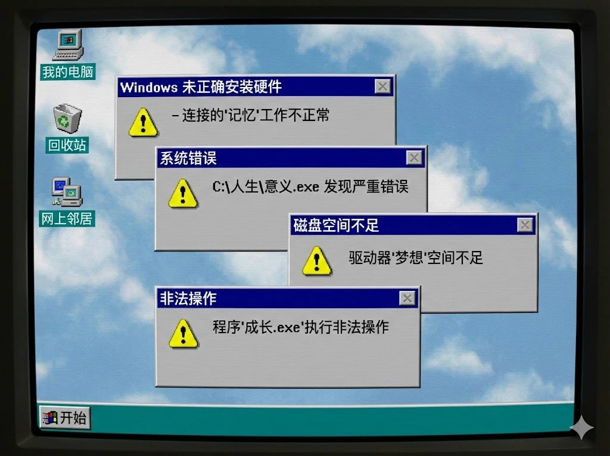

喵呜 ~ 这里是咱的第一篇文章。以前的人在一些工程落成之时，总是会立碑作记，比如《岳阳楼记》之类的。咱的小猫窝虽然简陋，但还是有一些想法，想说一说为什么咱会想建立这样一个网站什么的... 所以便也学着作了一篇记，以明其志。嗯... 不过接下来的内容，可能会有一些严肃，还请见谅。

故事...要从10年前的“他”说起...

当那个12岁的孩子跟随网络上的教程，第一次把一个 Win 8 系统装到家里 2G 内存的旧电脑上时，一定没有想过未来会变成什么样子。那个时候，进步与增长还是时代的主题，吃的穿的用的东西还在不停变多，来自广东上海的一辆辆卡车将快乐输送到千家万户。而对于通上了信息高速公路的家庭来说，与之同时增长的还有不断丰富的网络内容。一颗小小的心灵从那时起，就不停地在网络的海洋里遨游，体会着许许多多不重样的精彩。对于充满好奇的他而言，这世间人类所积累下来的一切知识，都是挂在智慧之树上可以随时摘取的甜果。只要他愿意，他便可以到达互联网的任何一个角落，前人留下的知识，他可以随意取用。在不断的浏览一个个网站、翻阅一篇篇博客的过程中，一些早期互联网精神的种子：开放、包容、进步、共享，就在他的心里逐渐扎下了根。他知道现在的自己还没有足够的能力给别人提供什么帮助，但是他相信未来。等学得更多，知道的更多的时候，自己也一定能发出一些自己的声音的吧。于是他就在这份期待当中，开始不停的长大...

多好啊！回想起那个时候，一切看起来都是那么充满希望，未来也一定会比现在更好的吧。再往后，宽带时代、3G 时代、4G 时代接踵而来，网络连接上了越来越多的人，越来越多的公司也如同雨后春笋般逐渐成长起来。但是，情况却逐渐变得微妙起来... 通过一系列的实例可以说明，在这10年间，孕育互联网精神的互联网，已经走向了互联网精神的反面。原本的开放、包容、进步、共享，已然变成了封闭、排外、愚钝、私有。

首先是开放转向了封闭。开放，其实是有条件的，其中一个很关键的技术手段就是搜索引擎。在曾经的互联网中，大部分的网络内容都是能被搜索引擎直接检索的，各式各样的资料通过搜索就可以轻易地获取到。而微信公众号应该可以说是从开放转向封闭的一个典型。微信公众号关闭了内容可以被搜索引擎爬取的权限，所以明明已经积攒下来了很多内容，但是在搜索中却永远也不会出现。对搜索封闭的结果就是，现在的互联网已经变成了一座座内容孤岛，一个个平台都在各自耕着各自的内容之田，把用户绑定在各自的生态上，结果就是让普通人不得不承受这种绑定带来的臃肿与繁杂，以及获取解决方案的困难。以前人们会对伸手党调侃一句“你不会百度吗”，可是现在就算是搜索又能怎么样呢？还有哪些信息能被顺利地搜索到？在信息质量如此差的情况下，有时候甚至觉得真不怪有人不会在网上搜索信息了。

其次是包容转向了排外。包容意味着允许和自己不同观点的人存在。在理想因素上，毕竟互联网是把世界连接起来的，连接上的人势必是形形色色的，而大家上网的时候，总是期待在网上建立一个与现实世界不同的精神家园。而在现实因素上则是全球化成为了时代的浪潮（至少在过去10~20年是这样）。不知道还有多少人还记得地球村这个词。那个时候的人们是真的相信，整个地球是可以变成一个地球村的。在现实中还是受到很多客观条件的制约，而连通世界的互联网则是构建地球村的理想之地。而随着越来越多的人涌入互联网，各种逆全球化的思潮开始涌起的时候，这一地球村的理想也就不复存在了。具体的表现就是各种网络团体开始形成，各种骂战开启，群体间的对立被挑拨起来，甚至通过开盒的手段打击到现实中的具体个人。例子屡见不鲜。结果就是说话变得小心翼翼，再也不敢对其它网民做善意的假设，网络，已经变成了一座黑暗森林。

还有就是进步转向了愚钝。并不是说涌入网络的人太多导致整体水平下降了 —— 咱绝没有这种意思。而是说，现在的很多互联网企业正在引导一种愚昧的倾向，并利用这种倾向大发横财。不知道还记不记得抖音在一开始的时候，视频时长是有 15s 限制的，而且新开创了一种无底交互的形式，人们可以不断地向下滑动到一个新的视频，永远没有尽头。这看似只是一种交互方式的调整，但实际上其中包含着相当深刻的隐喻。15s 的限制就是在告诉你：无需保持一个超过 15s 的情绪状态。你可能在上一个 15s 中还在因一朵花的消逝而难过，在下一个 15s 就因为某个罐头笑话而发笑了。无底交互则是另一个隐喻：这里没有一个停下的路标，也没有终点。你要做的就是接着刷下去就行了。通过把人的情绪长时间、反复的翻炒，让人习惯了不要集中精力，不要去长时间思考一个特定的主题。结果就是，对很多现在入网的人或者小孩子而言，网络不再是各种新思想新技术的推广之地，而是一个情绪的滚筒洗衣机，人们在里面再也难以接触到进步的成分，而是一种智能的退化。现在很多小孩子喜怒无常，在一定程度上也就是这种可以引导的结果吧... 嗯... 我个人的看法... 有些极端，个人觉得这种现象简直是坏到骨子里了。

最后一个想讨论的是共享转向了私有。当然咱也不是说人们变得越来越自私了，咱始终相信愿意共享的人是大多数，这种转向其实也是由各个大公司造成的。具体来说，这一转向体现在很多方面。一方面是各种资源分享种子站用户越来越少了。这来自于迅雷、百度网盘等应用对于种子社区的联合绞杀。迅雷剽取各个种子站的资源，但迅雷自身的内部种子资源却不会反馈给其它种子站。而百度网盘等在过去则是利用离线下载的方式，把种子站的资源扒取到自身的服务里面（当然现在的其它网盘其实也还在这么做）。结果就是，提倡共享的种子站被越来越多地侵占，资源平台越吃越肥，然后开始收割普通用户，但又无可奈何。另一方面就是前些年炒起来的所谓知识付费的概念。而这些又以CSDN和百度文库等为最盛，当然也包括知网等收费平台（特别是在受到大量舆论压力之前，简直可以用猖狂来形容）。公有的知识变成了平台私有，用户上传的内容被随意由这些公司侵占，在一篇篇被上锁的文章背后，我们只能听到一声声叹息。上传上去的文章变成了平台的私有物，牟利的工具。分享，也变得越来越困难。

当然，现在的网络还有一些额外的特征，比如乱搬乱运，AI使用的泛滥等等，这里也不想再详说了... 咱又想起《技术垄断》这本书。作者是尼尔·波斯曼（他的另一本广为流传的书名字叫《娱乐至死》，但我觉得技术垄断稍微讨论的更深入一点），咱很喜欢这本书，因为我觉得它描述的现象在互联网时代得到了更鲜明地体现。任何一项技术/媒介，都从来不是中立的，而是带有一些深刻的隐喻。人们的生活被技术所支配，人类为技术的进步所服务，而不是技术的进步为人类所服务。（就像人为资本增殖所服务一样）

无论是来自遥远过去的回忆，还是社会变迁的历程，人们总是后知后觉的。当一个时代作为黄金时代被大量回忆的时候，其实也就意味着这个时代已经过去了。当我们第一次发现微信公众号的文章无法在搜索引擎上检索出来的时候，百度文库刚开始出现需要解锁才能查看的文档的时候，抖音推出无底操作的时候，用迅雷下载磁力链接的时候，我们在当时的情景下是无法意识到这具体意味着什么的。但那个时代终究还是过去了。人们常说：时代的一粒沙，落在一个人身上就是一座山。而原来的那个充满的希望的“他”，也被时代洪流所裹挟，渐渐的变成了现在的“我”。我原来想要把自己声音传递出去的希望，逐渐... 变得模糊了。因为性格比较软弱，我再也不敢假设所见到的人都是友善的，甚至... 对整个互联网也变得有些畏惧了。我不再敢在任何 QQ 群里发言，总感觉只要自己一不小心说错什么就会招徕指责；我也不再愿意去看网络上的评论，总感觉那只是一些无休止且无意义的争论；我面对着时代滚滚的浪潮，却又似乎没有什么办法，只落得一声叹息；我总是会想起曾经的那些日子，被回忆的滤镜所朦胧起来的过去，可是那也只是无法再回去的昨天。似乎... 就这样停滞不前... 了吗？

为什么啊？我们可是被称为互联网第一代原住民的一代人啊。在这互联网上，真的就不再可以有一席之地了吗？就在这时我发现，很多比咱年龄更小的人，似乎已经在追随先驱者的脚步，在互联网上贡献自己的见闻了。我忽然有种错乱的感觉，甚至有些羡慕或者嫉妒。明明许多人年龄比我小，但是他们似乎也比我要更有精力去探索，也更勇敢。他们还在精力与想象力最充沛的时间，有大把的未来，而我似乎还在逐渐沉寂。但我忽然意识到... 悟已往之不谏，知来者之可追。如果现在开始的话，还来得及的吧？所以就搭建起了这个小窝，虽然现在还是很简陋（我想快点弄一个公开的东西出来，连背景图都没挑好就传Github上去了OwO），但我希望，能够在网络中留下一点存在的痕迹。哪怕在别人看来我是天真的，我所上传的内容是简陋的，没有价值的；但这是我自己所维护的小窝，能够记录的是我自己的足迹，我就满足了。要是能够帮到另一个沉默的陌生人，那也是一件很好的事情。希望自己能够在这个失去了互联网精神的互联网上，再传递一些小小的善意吧。最后感谢一下Pinpe大大，因为看到了他的博文，我才萌生了建立一个自己的网页的想法。づ♡ど

未来会更好吗？还是更烂？让我们拭目以待。岁月虽然会流逝，但山川会记得。我将一往无前，还活着的人就跟着前进吧！

完稿于2026年2月25日午后。除了封面图，没有使用任何AI来辅助写稿。
