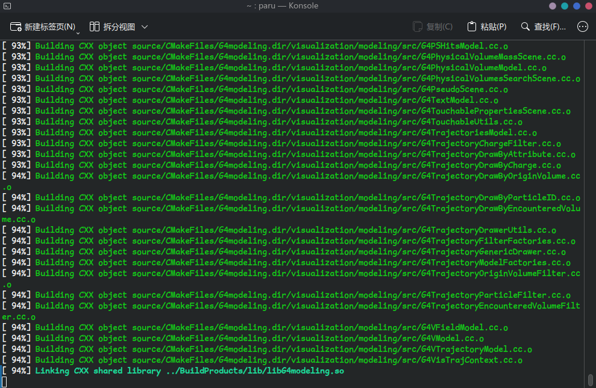
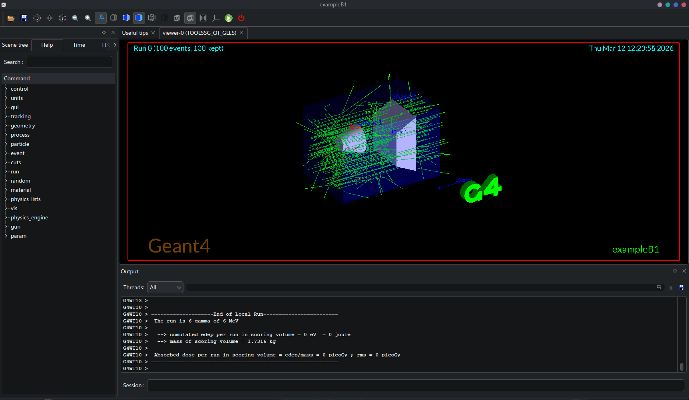
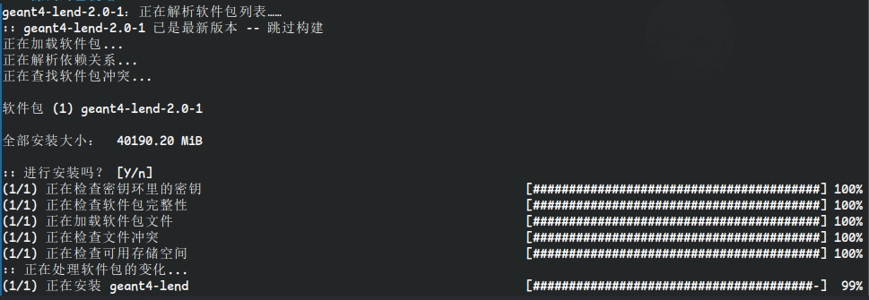
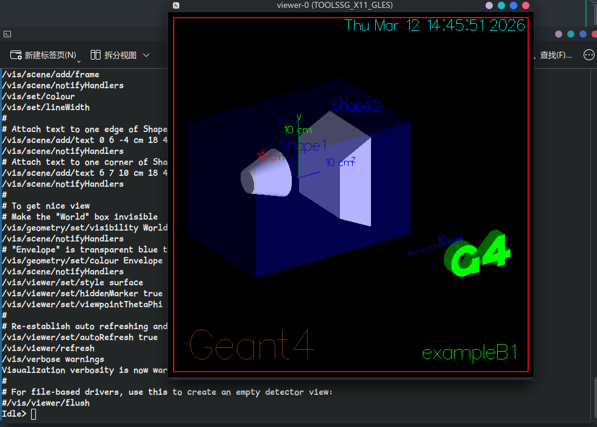
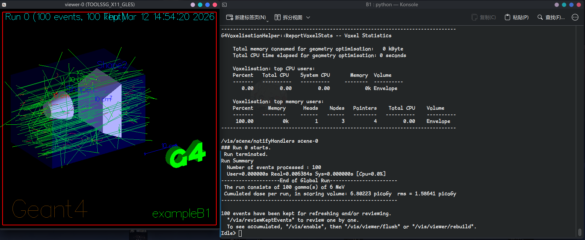
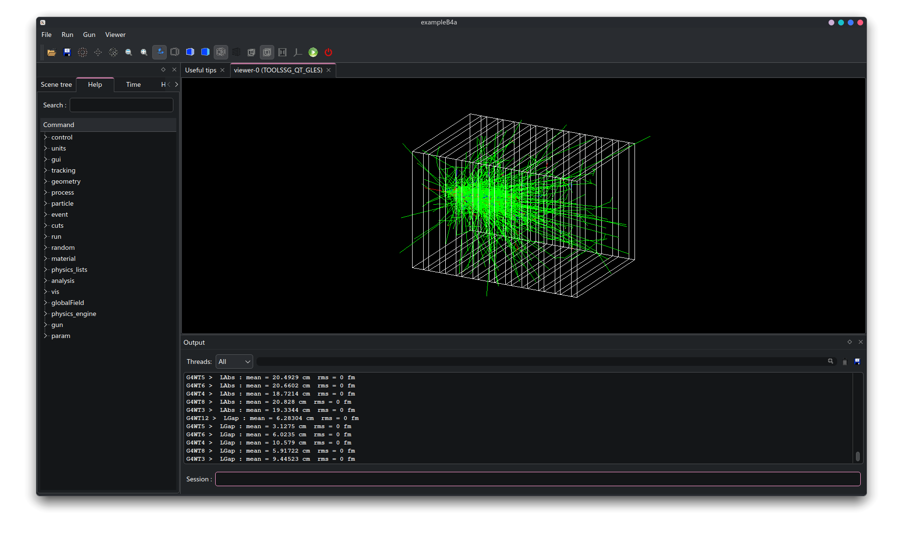
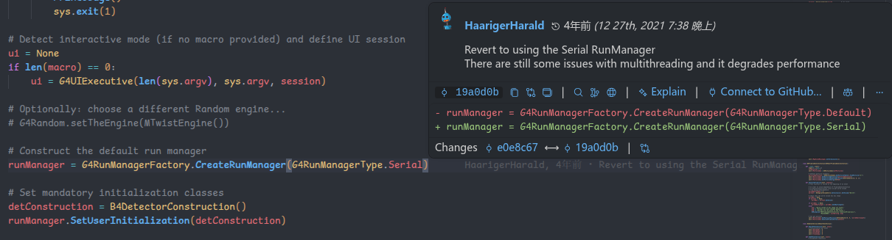

## 安装

在安装 Geant4 之前，可以先装一个 root～ 毕竟 root 和 Geant4 都是 cern 的软件，用 root 来分析 Geant4 模拟结果也是相当常见的一个选项了。不过咱更习惯直接输出 csv 文件拿 python 分析来着...

```bash
sudo pacman -Syu root-cuda
```

安装 Geant4 的话，[官网](https://geant4.web.cern.ch/documentation/dev/ig_html/InstallationGuide/index.html)上提到很多方法。可以通过 conda 安装到虚拟环境里面，也可以通过 [AUR 仓库](https://aur.archlinux.org/packages/geant4?all_deps=1#pkgdeps)来装。还可以直接编译源码来安装。之前在 Windows 电脑上装的时候，咱就是直接编译的源码，不过既然在 Arch 上嘛，就要发挥一下 Arch 的特色，那就用 AUR 仓库的吧～ 这里顺便提一句，在 Windows 上安装的话麻烦的要多，咱记得当时运行起来也费了不少功夫OwO。如果之后有空的话，可以再写一个文档说说怎么在 Windows 上安装 Geant4。

[AUR 仓库](https://aur.archlinux.org/packages/geant4?all_deps=1#pkgdeps)里直接搜索 Geant4 的话可以找到这么几个主要的版本：geant4 / geant4-debug / geant4-full / geant4-full-debug。咱个人是比较推荐安装 geant4-full 这个版本的。这个版本会把（除了低能核数据库 LEND 之外的）各种数据库都预装好，环境变量也设置好，而且会尽可能开启可视化以及更多的功能。下面咱把 geant4 和 geant4-full 的 PKGBUILD 中 cmake 配置的部分贴出来，对比一下可以看到有哪些差别。

`geant4`

```PKGBUILD
prepare() {

    cd ${srcdir}

    local cmake_options=(
        -B build
        -S ${pkgname}-${_pkgver}
        # Standard options
        -D CMAKE_INSTALL_PREFIX=/usr
        -D GEANT4_USE_G3TOG4=ON
        -D GEANT4_USE_GDML=ON
        -D GEANT4_USE_INVENTOR_QT=ON
        -D GEANT4_USE_OPENGL_X11=ON
        -D GEANT4_USE_QT=ON
        -D GEANT4_USE_RAYTRACER_X11=ON
        -D GEANT4_USE_SYSTEM_CLHEP=ON
        -D GEANT4_USE_SYSTEM_ZLIB=ON
        -D GEANT4_USE_XM=ON
        # Advanced options
        -D GEANT4_INSTALL_PACKAGE_CACHE=OFF
        -D GEANT4_BUILD_TLS_MODEL=global-dynamic
    )

    env -i \
        QT_SELECT=6 \
        PATH=/usr/bin \
        cmake "${cmake_options[@]}"
}
```

`geant4-full`

```PKGBUILD
build() {

  cd "${srcdir}"
  echo "
export PATH=\$PATH:/opt/Geant4/Geant4-v${pkgver}/bin
export G4NEUTRONHPDATA=/opt/Geant4/Libraries/G4NDL4.7.1
export G4LEDATA=/opt/Geant4/Libraries/G4EMLOW8.8
export G4LEVELGAMMADATA=/opt/Geant4/Libraries/PhotonEvaporation6.1.2
export G4RADIOACTIVEDATA=/opt/Geant4/Libraries/RadioactiveDecay6.1.2
export G4PARTICLEXSDATA=/opt/Geant4/Libraries/G4PARTICLEXS4.2
export G4PIIDATA=/opt/Geant4/Libraries/G4PII1.3
export G4REALSURFACEDATA=/opt/Geant4/Libraries/RealSurface2.2
export G4SAIDXSDATA=/opt/Geant4/Libraries/G4SAIDDATA2.0
export G4ABLADATA=/opt/Geant4/Libraries/G4ABLA3.3
export G4INCLDATA=/opt/Geant4/Libraries/G4INCL1.3
export G4ENSDFSTATEDATA=/opt/Geant4/Libraries/G4ENSDFSTATE3.0
export G4CHANNELINGDATA=/opt/Geant4/Libraries/G4CHANNELING2.0
export G4PARTICLEHPDATA=/opt/Geant4/Libraries/G4TENDL1.4
export G4NUDEXLIBDATA=/opt/Geant4/Libraries/G4NUDEXLIB1.0
export G4URRPTDATA=/opt/Geant4/Libraries/G4URRPT1.1" > Geant4.sh

  echo "
setenv PATH \$PATH:/opt/Geant4/Geant4-v${pkgver}/bin
setenv G4NEUTRONHPDATA /opt/Geant4/Libraries/G4NDL4.7.1
setenv G4LEDATA /opt/Geant4/Libraries/G4EMLOW8.8
setenv G4LEVELGAMMADATA /opt/Geant4/Libraries/PhotonEvaporation6.1.2
setenv G4RADIOACTIVEDATA /opt/Geant4/Libraries/RadioactiveDecay6.1.2
setenv G4PARTICLEXSDATA /opt/Geant4/Libraries/G4PARTICLEXS4.2
setenv G4PIIDATA /opt/Geant4/Libraries/G4PII1.3
setenv G4REALSURFACEDATA /opt/Geant4/Libraries/RealSurface2.2
setenv G4SAIDXSDATA /opt/Geant4/Libraries/G4SAIDDATA2.0
setenv G4ABLADATA /opt/Geant4/Libraries/G4ABLA3.3
setenv G4INCLDATA /opt/Geant4/Libraries/G4INCL1.3
setenv G4ENSDFSTATEDATA /opt/Geant4/Libraries/G4ENSDFSTATE3.0
setenv G4CHANNELINGDATA /opt/Geant4/Libraries/G4CHANNELING2.0
setenv G4PARTICLEHPDATA /opt/Geant4/Libraries/G4TENDL1.4
setenv G4NUDEXLIBDATA /opt/Geant4/Libraries/G4NUDEXLIB1.0
setenv G4URRPTDATA /opt/Geant4/Libraries/G4URRPT1.1" > Geant4.csh

  [ -d "${srcdir}"/build ] || mkdir "${srcdir}"/build
  cd "${srcdir}"/build

  cmake \
    -DCMAKE_POLICY_VERSION_MINIMUM=4.0 \
    -DCMAKE_INSTALL_PREFIX=/opt/Geant4/Geant4-v${pkgver} \
    -DCMAKE_BUILD_TYPE=RelWithDebug \
    -DGEANT4_BUILD_MULTITHREADED=ON \
    -DGEANT4_INSTALL_DATA=ON \
    -DGEANT4_INSTALL_DATASETS_TENDL=ON \
    -DGEANT4_INSTALL_DATASETS_URRPT=ON \
    -DGEANT4_INSTALL_DATASETS_NUDEXLIB=ON \
    -DGEANT4_USE_G3TOG4=ON \
    -DGEANT4_USE_GDML=ON \
    -DGEANT4_USE_FREETYPE=ON \
    -DGEANT4_USE_QT_QT6=ON \
    -DGEANT4_USE_INVENTOR_QT=ON \
    -DGEANT4_USE_OPENGL_X11=ON \
    -DGEANT4_USE_QT=ON \
    -DGEANT4_USE_RAYTRACER_X11=ON \
    -DGEANT4_USE_SYSTEM_ZLIB=ON \
    -DGEANT4_USE_XM=ON \
    -DGEANT4_INSTALL_PACKAGE_CACHE=OFF \
    -DGEANT4_USE_PYTHON=ON \
    -DGEANT4_USE_TBB=ON \
    -DGEANT4_BUILD_TLS_MODEL=global-dynamic \
    -DGEANT4_INSTALL_DATADIR=/opt/Geant4/Libraries \
    ../geant4-v${pkgver}


  #set GEANT4_BUILD_TLS_MODEL=global-dynamic and GEANT4_USE_PYTHON=ON for compatibility with g4python
  make #VERBOSE=1
}
```

留心一下 PKGBUILD 文件就能发现，geant4-full / geant4-debug / geant4-full-debug 这三个版本把 Python 绑定所需要的两个编译选项都开了，而 geant4 版本就没有开。另外，还有个很有意思的事情ww。geant4-full 的编译选项是 RelWithDebug，而 geant4-full-debug 的编译选项却是 Release。倒反天罡了属于是。

安装的话我还是用管理器来安装吧。

```shell
paru -Syu geant4-full
```

然后就是喜闻乐见的编译环节...() 睡个觉先..zzZ

一共用了 40 多分钟... 嗯，很符合咱对 geant4 编译时间的印象。记得编译完准备安装的时候输一下 sudo 密码，因为 sudo 免密时间应该只有 10 分钟。不过就算睡过头忘记输密码了，编译也是完成了的，重新 paru 一下就可以直接安装好了。



安装的位置在 `/opt/Geant4/Geant4-v11.4.0/` ，核数据库存在于 `/opt/Geant4/Libraries/` 中。在 `/opt/Geant4/Geant4-v11.4.0/share/Geant4/examples/` 就可以找到 geant4 官方的那些示例了。刚刚安装好的时候 echo 一下 $PATH，这个时候环境变量是还没有生效的，不过环境变量的配置已经放到 `/etc/profile.d/Geant4.sh` 中了，建议直接重启一下让环境变量生效。

## 运行示例

试试示例能不能跑吧。从 `/opt/Geant4/Geant4-v11.4.0/share/Geant4/examples/basic` 里面把 B1 复制到用户目录下某个地方，在文件夹下打开终端，然后创建个 build 目录放编译的文件，cmake 一下上级文件夹生成 Makefile，然后再 make。build 目录里应该就有一个可执行文件 exampleB1 了。嗯～ 一个报错都没有，真棒。运行一下试试...

```shell
# /.../B1/
mkdir build
cd build
cmake ..
make
./exampleB1
```



耶！还是深色模式的ww

需要注意的是，在程序退出清指针的时候，出现了一个段错误：`QMetaObject::invokeMethod: No such method QObject::stopTimer()`。感觉这个更像是 QT 版本兼容的问题，应该关系不大，Geant4 本身的那些对象的指针都是正常清掉了的。

闲着的时候，顺便把低能核数据库也装一下吧。注意，这个数据库包含 ENDF.BVII 和 ENDF.BVIII 的一堆数据，解压之后有 40 多个 G！要是真用不着的话其实也可以不装的。

```shell
paru -S geant4-lend
```



## Python 绑定

[官网](https://geant4.web.cern.ch/documentation/dev/bfad_html/ForApplicationDevelopers/LanguageBindings/languageBindings.html)上给出了两个 python 绑定库。其中 [geant4_pybind](https://github.com/HaarigerHarald/geant4_pybind) 看起来是一个更进步一些的库，所以就装这个了。

在 conda 里面创建一个名叫 g4 的环境，先装一些常用的库

```shell
conda create -c conda-forge -n g4 python numpy matplotlib scipy tqdm pandas
conda activate g4
conda install cuda-cudart cuda-version=13  # 顺便装个 cuda 支持
```

然后通过 pip 安装 python 绑定

```shell
pip3 install geant4-pybind
```

再找个目录把这个项目克隆下来

```shell
# 在某个目录下
git clone https://github.com/HaarigerHarald/geant4_pybind.git
```

在 `/.../geant4_pybind/examples/` 下，有不少示例，再找 B1 跑一下试试吧。

```shell
# /.../geant4_pybind/examples/B1/ 下，conda 环境为 g4
python exampleB1.py
```



图形界面也是可以显示出来的。在 Idle> 这里，输入 geant4 命令就可以运行模拟了，比如发射 100 个粒子：

```geant4
Idle> /run/beamOn 100
```



输入 exit 就可以安全退出啦。

```geant4
Idle> exit
```

输入 help 可以查看各个命令的用法。

```geant4
Idle> help
```

## 性能比较

试试看 Python 绑定的版本和 C++ 直接编译出来的版本性能有哪些差异。这次使用 B4a 这个示例，示例定义的具体探测器结构不详细考虑了，但总之就是在探测器中会产生很多电子，然后每个 Event 记录一下能量沉积之类的数据，再统计到 root 文件中。不用 B1 来测试主要是因为 B1 的输出都是输出到 tty 的，我感觉 IO 速度也可能影响模拟效率，所以就找了个会保存 root 文件的 B4a 来测试了ww～ 下面这张图可以看一下 B4a 中间探测器的结构。



测试的时候，使用的都是同样的一份 .mac 文件，如下。每次测试一共发射十万个电子。

```mac
# Macro file for example B4
#
# To be run preferably in batch, without graphics:
# % exampleB4[a,b,c,d]  -m run2.mac
#
# Produce Histograms and Ntuples
#
#/run/numberOfThreads 4
#/control/cout/ignoreThreadsExcept 0
#
# reduce the verbosity level for EM and hadronic physics
#/process/em/verbose 0
#/process/had/verbose 0
#
/run/initialize
#
# Default kinemtics:  
# electron 300 MeV in direction (0.,0.,1.)
# 10000 events
#
/run/printProgress 1000
/run/beamOn 100000
```

还需要注意的是，Python 因为线程锁的原因，多线程的表现可能并不好。下面是 Python 绑定库作者的原话：多线程还存在一些问题而且会削弱性能。不过我还是对 C++ 程序和 Python 测试了单线程和多线程两种情况。把 Python 下的 G4RunManagerType 改成了 Tasking，这样实测是可以开 16 个线程的。在 Unix 系统下，使用 time 命令运行程序就能测试程序运行时间啦～



```shell
time python exampleB4a.py -m run3.mac
```

```shell
# C++ 文件目录
time ./exampleB4a -m run3.mac
```

测试结果：

- C++ 单线程：67.18s user 0.03s system 99% cpu 1:07.42 total
- Python 单线程：48.17s user 0.05s system 99% cpu 48.472 total
- C++ 16 线程：128.15s user 0.18s system 1379% cpu 9.305 total
- Python 16 线程：89.78s user 51.02s system 122% cpu 1:55.07 total

总用时：C++ 16 线程 < Python 单线程 < C++ 单线程 < Python 16 线程

Python 多线程还是太拉了... 不过单线程的 Python 程序比单线程的 C++ 程序还要快是咱没想到的。
