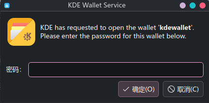

之前配置了 sddm 的自动登录（在 /etc/sddm.conf 中添加自动登录字段）。但这种自动登录方式是不保存密码的，导致每次开机的时候，都会弹出一个窗口提示输入 KDE Wallet 的密码，感觉很不舒服，而且也影响了开机自动连接无线网，需要在 KWallet 中输入密码才能连。于是就查了一下 [Archlinux Wiki](https://wiki.archlinux.org/title/KDE_Wallet)，发现是可以配置每次开机时自动登录的，同时在这个过程中也了解了更多 linux 身份验证相关的知识，所以来简单记录一下～



系统：Archlinux / Wayland 1.24.0 / KDE Plasma 6.6.1 / sddm 0.21.0

sddm 在之前配置的自动登录：
`/etc/sddm.conf`

```sddm
[Autologin]
User=FennecTian
Session=plasma.desktop
Relogin=false
```

## 概念&理解

什么是 KDE Wallet？KDE Wallet Manager 是一个用于管理 KDE Plasma 系统上密码的工具。使用 KWallet 子系统允许用户保存自己的秘密信息，同时也允许用户访问由所有与 KWallet 集成的应用程序存储的密码。感觉上类似于 Windows 上的凭据管理器，可以在各种场合提供登录密码，比如 SSH。

而 PAM 则是 Pluggable Authentication Modules 的缩写，中文常翻译为可插拔认证模块。可以把它理解成 Linux 上“登录/验证身份/开会话”的一套通用框架：不管你是用终端登录、sudo、图形登录（SDDM/GDM/LightDM）、解锁屏幕、改密码……这些程序都可以把“怎么验证你是谁、验证后要做哪些事”交给 PAM 来统一处理。（类似于 Windows Hello？）

PAM 配置文件存放于 `/etc/pam.d/` 目录下，定义了每个程序调用 PAM 时如何进行验证。

[Wiki](https://wiki.archlinux.org/title/KDE_Wallet) 里提到：当系统使用 dm-crypt 加密时，可以通过解密磁盘的密码短语自动解锁 KDE Wallet。但很遗憾的是我没有 dm-crypt 加密。不过 Wiki 里也提到了采用一个可以保存密码的自动登录方式，比如 pam_autologin。下面就配置这种方法。

## 配置

Wiki 里提到检查 PAM 是否配置正确。Wiki 中说，以下行必须存在于其对应的部分下。对于 SDDM 则是已经存在于 `/etc/pam.d/sddm` 中。

```pam
auth            optional        pam_kwallet5.so
session         optional        pam_kwallet5.so auto_start
```

但是咱不太放心，所以又自己检查了一遍，看起来是没问题的。这部分设置可以使 PAM 在登录会话时自动给 KWallet 提供密码。需要注意的是 KWallet 密码需要和用户密码保持一致才能自动提供。

然后安装 pam_autologin。这是一个 AUR 包。

```bash
paru -S pam_autologin # 不使用paru的话可以替换为yay或其他方式
```

安装好之后，修改 `/etc/pam.d/sddm`，把这一行插到最前面，其他行保持不变

```pam
auth    required    pam_autologin.so
```

这个可以让 sddm 利用 PAM autologin 记录的密码来登录。

然后通过创建 pam_autologin 配置文件，告知自动登录模块保存下次登录

```bash
sudo touch /etc/security/autologin.conf
```

然后触发一次登录。删除 sddm 的配置文件 `/etc/sddm.conf` 中关于 autologin 的内容，然后重启，手动登录一次。这个时候可以查看 `/etc/security/autologin.conf` 这个文件，它应该现在变为 root 只读而且有内容了。里面就保存了密码信息ww～

下一步，恢复 `/etc/sddm.conf` 中 autologin 字段，重新开启 autologin。不过现在我们不再用默认的啥也不管直接通过的认证方式，而是采用 pam_autologin 进行认证。把 `/etc/pam.d/sddm-autologin` 里的内容全部替换为 `/etc/pam.d/sddm` 里的内容。再在 `/etc/pam.d/sddm-autologin` 的第一行添加 pam_autologin 验证方法：

```pam
auth    required    pam_autologin.so
```

然后再重启。现在进入系统的时候，应该就可以了～。现在 sddm 在自动登录的时候首先会从 pam autologin 那里要密码，然后走和正常登录一样的验证流程，一切安好～ 没有 KDE 弹窗，也可以自动给无线网提供密码了～

### 最终配置好的文件

`/etc/sddm.conf`

```sddm
[Autologin]
User=FennecTian
Session=plasma.desktop
Relogin=false
```

`/etc/pam.d/sddm`

```pam
#%PAM-1.0
auth        include     system-login
-auth       optional    pam_gnome_keyring.so
-auth       optional    pam_kwallet5.so

account     include     system-login

password    include     system-login
-password   optional    pam_gnome_keyring.so    use_authtok

session     optional    pam_keyinit.so          force revoke
session     include     system-login
-session    optional    pam_gnome_keyring.so    auto_start
-session    optional    pam_kwallet5.so         auto_start
```

`/etc/pam.d/sddm-autologin`

```pam
#%PAM-1.0
auth        required    pam_autologin.so
auth        include     system-login
-auth       optional    pam_gnome_keyring.so
-auth       optional    pam_kwallet5.so

account     include     system-login

password    include     system-login
-password   optional    pam_gnome_keyring.so    use_authtok

session     optional    pam_keyinit.so          force revoke
session     include     system-login
-session    optional    pam_gnome_keyring.so    auto_start
-session    optional    pam_kwallet5.so         auto_start
```

`/etc/security/autologin.conf`

```sddm
嘿嘿不告诉你～（其实是输入一次密码自动生成的内容啦）
```

当然～ 还有一种配置方法就是把 KWallet 密码设置为空。但是这样感觉也不安全，所以就没采用了OwO。

## 补充

下面这部分内容是 GPT 学长写的，介绍了一下 PAM 配置的相关概念ww：

--

### PAM 配置长什么样

你看到的 `/etc/pam.d/sddm`、`/etc/pam.d/login`、`/etc/pam.d/sudo` 等文件，就是给不同“服务”（service）定义规则：

每一行大概是：

```pam
<类型>  <控制标志>  <模块>  [参数...]
```

比如（简化理解）：

* `auth`：**认证**（你是谁？要不要密码/指纹？）
* `account`：**账号策略**（账号是否允许登录？是否过期？时间限制？）
* `password`：**改密码**相关
* `session`：**会话开始/结束**要做的事（创建环境、挂载目录、启动 keyring/kwallet 等）

控制标志常见的有：

* `required`：失败就最终失败，但通常会把后续跑完再统一判失败
* `requisite`：失败立刻终止
* `sufficient`：成功可能就够了（满足条件可提前成功）
* `optional`：成功失败通常不影响大局（更多是“能做就做”的附加功能）

行首 `-`，就是更“宽容”的处理方式，表示某些错误（常见是模块不存在/加载失败）会被忽略，不至于挡住登录。

### PAM 和 KDE Wallet / 自动登录的关系

* `pam_kwallet5.so`、`pam_gnome_keyring.so` 这种就是 PAM 模块：在登录过程中**顺便**把钱包/密钥环解锁并启动。
* 自动登录时常见问题是“没有输入登录密码”，PAM 就很难拿到口令去自动解锁钱包，所以 Arch Wiki 才会提到用 `pam_systemd_loadkey` 从 LUKS 解密口令里“借”出一份给钱包用。

--

## 文件备份（配置前的文件）

`/etc/pam.d/sddm`

```pam
#%PAM-1.0
auth        include     system-login
-auth       optional    pam_gnome_keyring.so
-auth       optional    pam_kwallet5.so

account     include     system-login

password    include     system-login
-password   optional    pam_gnome_keyring.so    use_authtok

session     optional    pam_keyinit.so          force revoke
session     include     system-login
-session    optional    pam_gnome_keyring.so    auto_start
-session    optional    pam_kwallet5.so         auto_start
```

`/etc/pam.d/sddm-autologin`

```pam
#%PAM-1.0
auth        required    pam_env.so
auth        required    pam_faillock.so preauth
auth        required    pam_shells.so
auth        required    pam_nologin.so
auth        required    pam_permit.so
-auth       optional    pam_gnome_keyring.so
-auth       optional    pam_kwallet5.so
account     include     system-local-login
password    include     system-local-login
session     include     system-local-login
-session    optional    pam_gnome_keyring.so auto_start
-session    optional    pam_kwallet5.so auto_start
```

以及删除保存的密码

```bash
sudo shred -u /etc/security/autologin.conf
```
