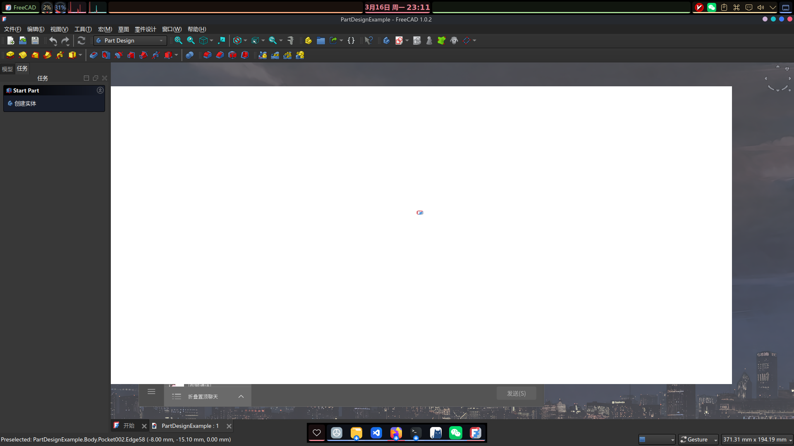
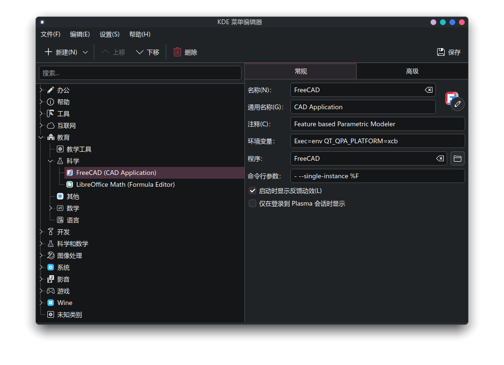

## FreeCAD 安装相关

咱通过 pacman 安装了 FreeCAD 之后，通过 desktop entry 打开时出现了一个情况：模型显示的窗口加载不出来：

然后我又尝试用命令行直接打开，本来是想看看有没有什么 debug 信息输出的，结果意外地发现通过命令行打开的时候就正常了？

所以我推测可能是环境变量传递的问题。考虑到安装的时候出现了大量 Qt，按照之前的经验 Qt 出问题很有可能是 QT_QPA_PLATFORM 这个环境变量有问题，所以就试着把这个环境变量添加进 desktop entry 里面：

然后再打开，一切正常了～
