Zotero 是一个文献管理工具，查看、分类、检索起文献来都很方便～ 正好这次过年回来，把咱电脑里放的乱糟糟的文献收拾一下吧。

## 安装

在 Arch 中安装 Zotero 比较简单的。在 AUR 仓库里，关于 Zotero 有这么几个包：稳定版 [Zotero](https://aur.archlinux.org/packages/zotero)、更新一点的版本 [zotero-bin](https://aur.archlinux.org/packages/zotero-bin)、以及开发版 [zotero-beta-bin](https://aur.archlinux.org/packages/zotero-beta-bin)

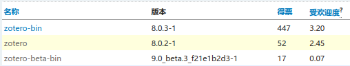

使用 AUR 包管理器即可安装。这里咱喵用的是 Paru, 使用 yay 的话把 'paru' 换为 'yay' 即可：

```bash
paru -Syu zotero # 或者安装 zotero-bin
```

## Zotero 文献管理方式

Zotero 按照条目的方式来整理文献信息。一个条目是一个参考文献及其元数据的集合，比如条目的信息、摘要、附件、笔记等等。具体而言一个条目包含以下内容：

- 信息：类型、标题、作者、出版物等等。目的类型很多：报纸期刊图书，甚至音频视频都可以算一个条目。标题作者访问时间等就不再多说了。
- 摘要：一串长文本说明文献的主要内容。
- 附件：该条目对应的文档/文件。附件按添加方式分有三种形式：
  1. 文件：通过这种方式添加时，Zotero 会将添加的文件拷贝到其工作目录下。例如在 Linux 上使用时，就会拷贝到 ~/Zotero/storage/ 下的各个文件夹中。文件夹的具体情况可以看下面这张图。通过这种方式添加的文档，在 Zotero 进行同步时，拷贝的文档也将进行同步。
  2. 文件链接：通过这种方式添加的文档不会复制到工作目录下，而是以链接的形式呈现。这样比较节省空间，但是文档不会同步。如果想把这种链接过来的文件转换为第一种这种直接复制过来的文件的话，可以使用**顶部菜单栏 - 工具 - 管理附件 - 转换已链接附件为已存储附件**
  3. 网页链接：这种方式添加的内容可以在点击之后打开浏览器查看。
- 笔记、标签、相关等。

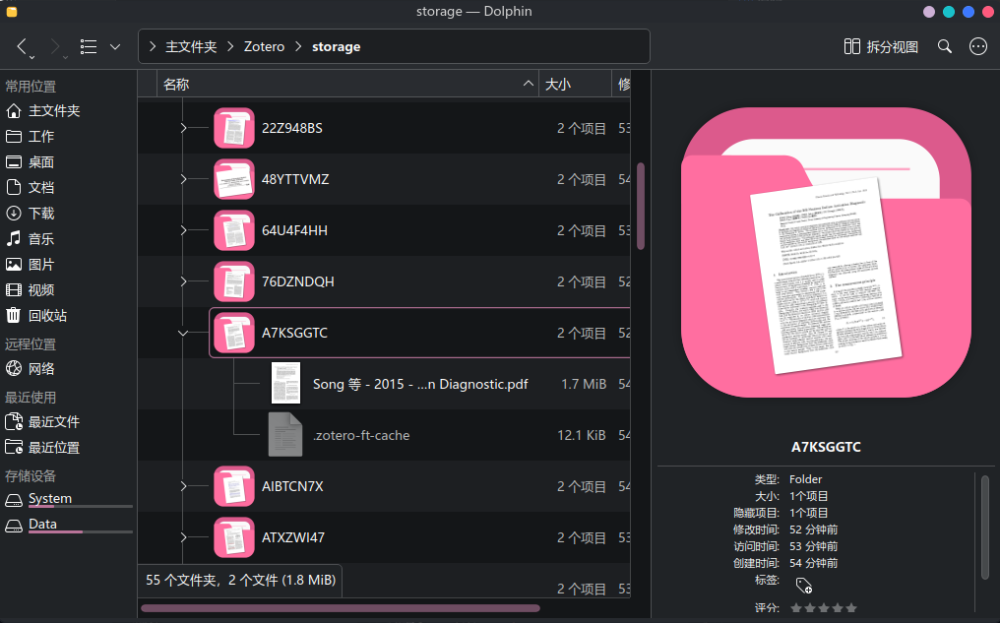

Zotero 的主页面主要分为三个板块。左侧为类别窗格、中间为条目浏览器、右侧为信息窗格。顶部为标签页选项卡，再顶部为菜单栏。如下图：

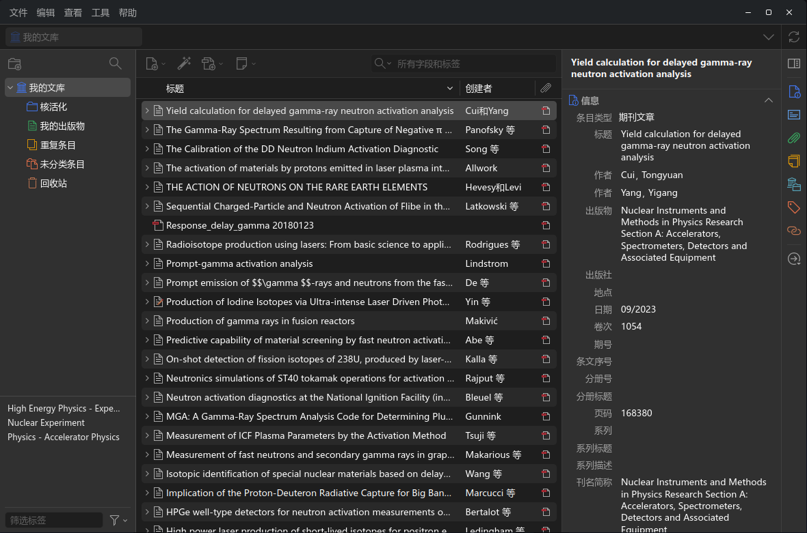

类别窗格的管理方式就像文件夹一样，点击添加分类的图标就可以添加一个新的类别。类别里面是可以接着套子分类的。

条目浏览器显示了该分类下的每一个条目。可以注意到条目左侧的箭头是可以展开的，展开之后为这个条目下所包括的附件和笔记。

信息窗格展示了这个条目所包含的全部信息。在这里可以对附件进行预览，也可以新建笔记等等。双击一个附件时，就可以在一个新标签页打开附件，而且对深色模式的支持还不错OwO。

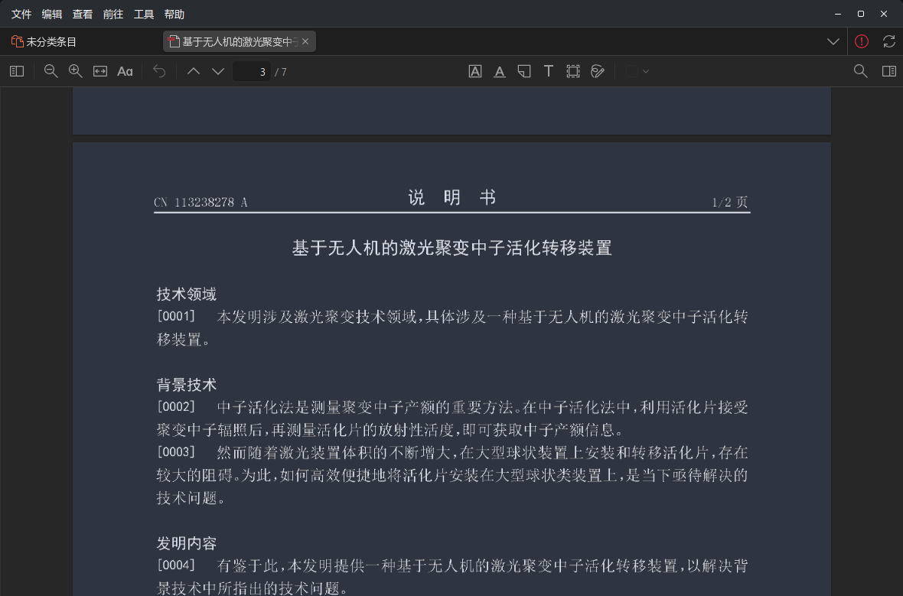

## 直接导入文献

在 dolphin 里面把文献选中，然后拖到 Zotero 页面里，它就开始自动扫描元数据了。

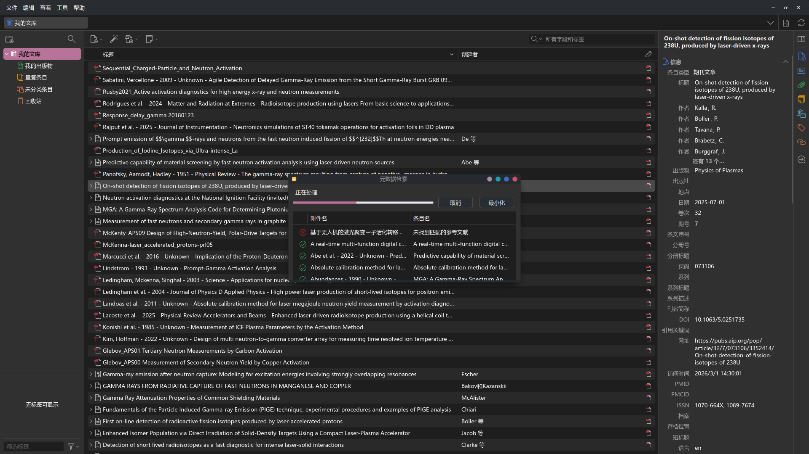

最后咱导入的这一批文献里面，大部分都被顺利地识别了出来，只有少部分上个世纪的文献和一篇中文专利没有识别。有时候 Zotero 会遇到中文文献识别不好的问题，可以通过安装插件来解决（见下文）

## 插件

Zotero 有着丰富的插件来满足许许多多额外的需求。官方的[插件仓库](https://www.zotero.org/support/plugins)就提供了不少插件了。此外，在 [Zotero 中文社区](https://zotero-chinese.com/plugins/)中也有不少内容。下面安装[茉莉花(Jasminum)](https://github.com/l0o0/jasminum)插件，该插件提供了从知网中获取元数据的功能。（不过目前也只能基于文献的文件名，从知网检索，而且最好是在可以从知网直接下载论文的校园网环境下使用）

### 下载插件

- 从中文社区插件商店下载。[Jasminum](https://zotero-chinese.com/plugins/#search=Jasminum)。下载的插件文件为 .xpi 文件，由于这也正好是 Firefox 的插件文件，所以如果是 Firefox 用户的话，需要在下载时选择从链接另存文件，见下图：
   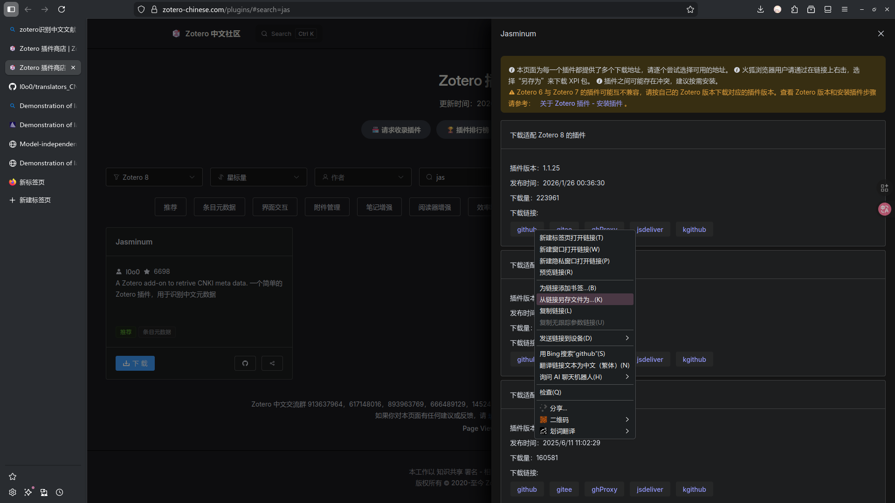
- 从 Github 下载。在中文社区插件商店就能找到作者的 Github 仓库链接。从这里下载版本可能会稍微新一些，而且如果插件有什么问题可以去 issues 里面先看看。

### 安装插件

顶部菜单栏 - 工具 - 插件，打开插件管理器，然后按下设置按钮 - Install Plugin From File，然后在对话框中选择刚刚下载的插件即可。见下图：
   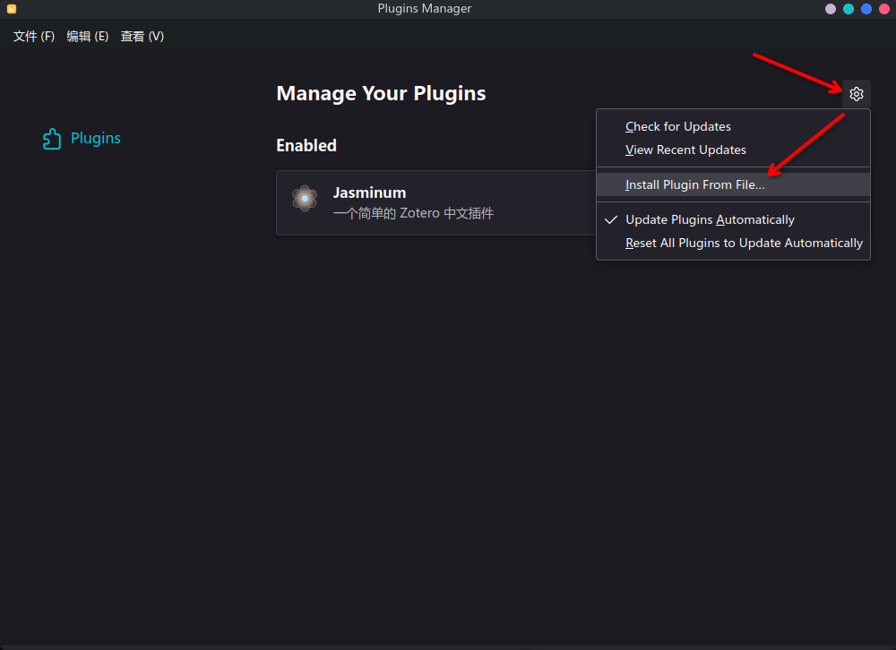

### 使用插件

将一篇中文文献导入 Zotero。在没有茉莉花的情况下直接用 Zotero 内置的工具检索元数据是失败的。在安装茉莉花后，右键这个文献，然后茉莉花抓取 - 抓取期刊元数据，就会弹出知网的安全验证窗口了。在通过安全验证后就可以抓取到元数据了～ 不过在我使用的过程中，看起来似乎并不是很稳定，每次抓取一个文件之后都要重启一下 Zotero 才能抓取下一个，感觉可能是知网本身安全限制的原因（知网是什么东西。。。）
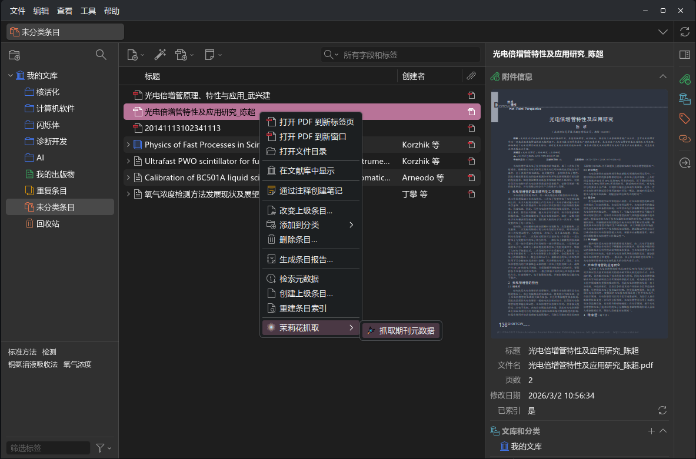
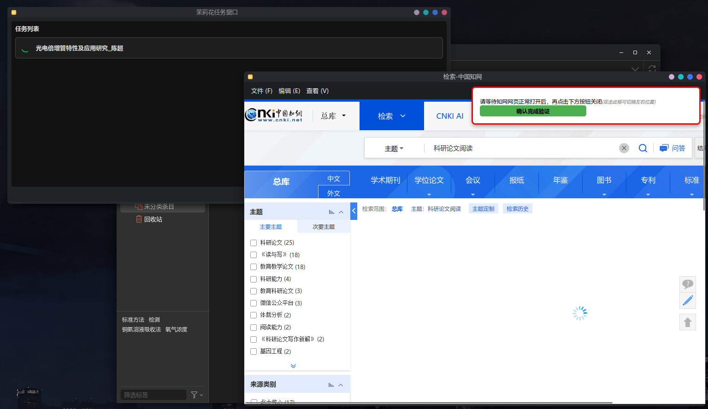
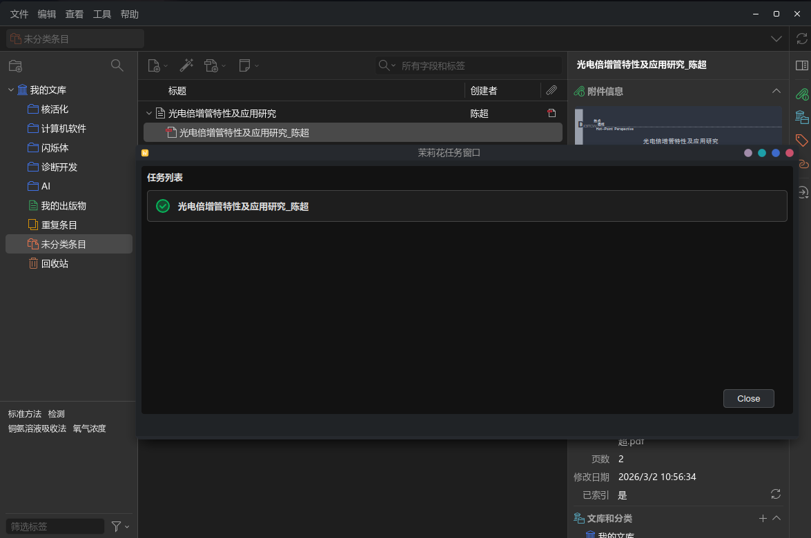

## 浏览器扩展

Zotero 有个官方浏览器扩展：[Zotero Connector](https://www.zotero.org/download/connectors)，可通过左边这个链接在 Firefox / Chrome / Safari / edge 上安装。在浏览器中一些特定的网页查看文献时，就可以直接在右键菜单中保存这个网页上的文献到 Zotero 上了。

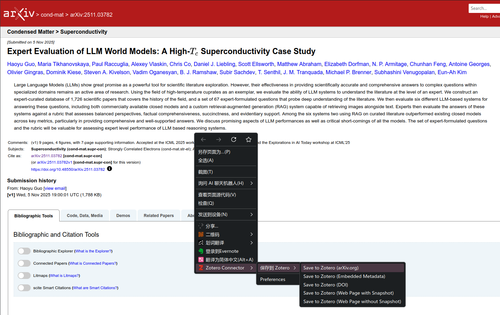

### 转换器是何意味??

英文为 Translator。这是一个与 Zotero Connector 经常一起出现的名词。个人理解这个东西与其说是叫做转换器，不如说是一个解析器，其实就是按照各个网页的规则解析这个网页。比如对于 arxiv，就会解析出评论（作为 Zotero 中的笔记）、网页快照、预印本 PDF 三种附件，并自动下载。

对于很多中文网页，转换器是由 [Zotero translators 中文仓库](https://github.com/l0o0/translators_CN)里的贡献者维护的。使用茉莉花插件也可以更新转换器。具体可以参考 [Zotero 中文社区里的这篇文章](https://zotero-chinese.com/user-guide/faqs/update-translators.html)。粗略一点的步骤就是：先到 Zotero 设置 - 茉莉花里面点击立即更新转换器，然后在各个浏览器的 Zotero Connector 首选项 - Advanced 中 Reset Translators。

实在抓取不下来的文献就只能手动添加信息了QwQ

---

就说这么多吧喵... 希望大家用的开心～
